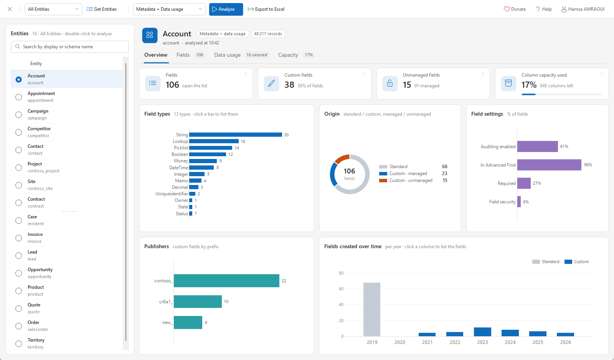
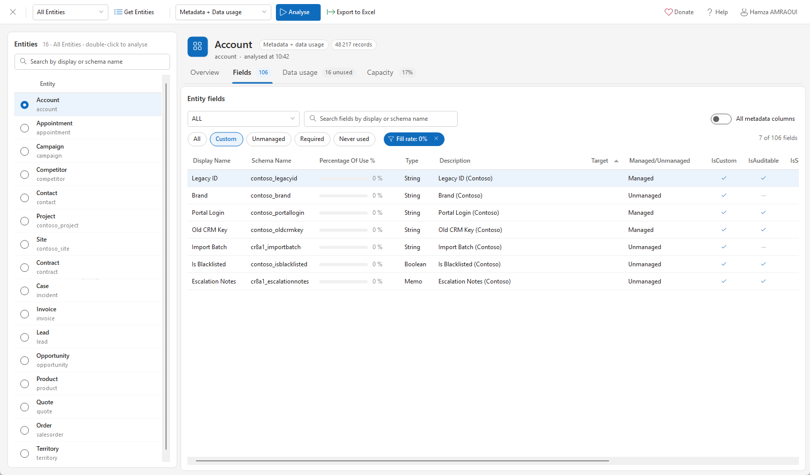
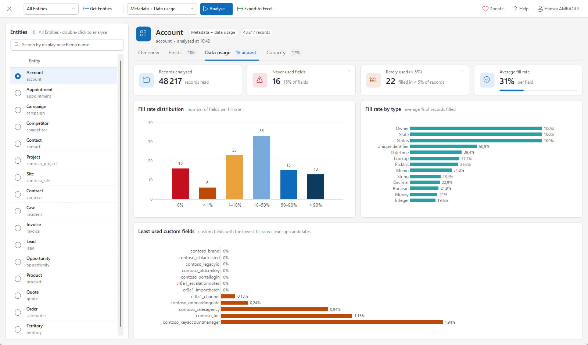
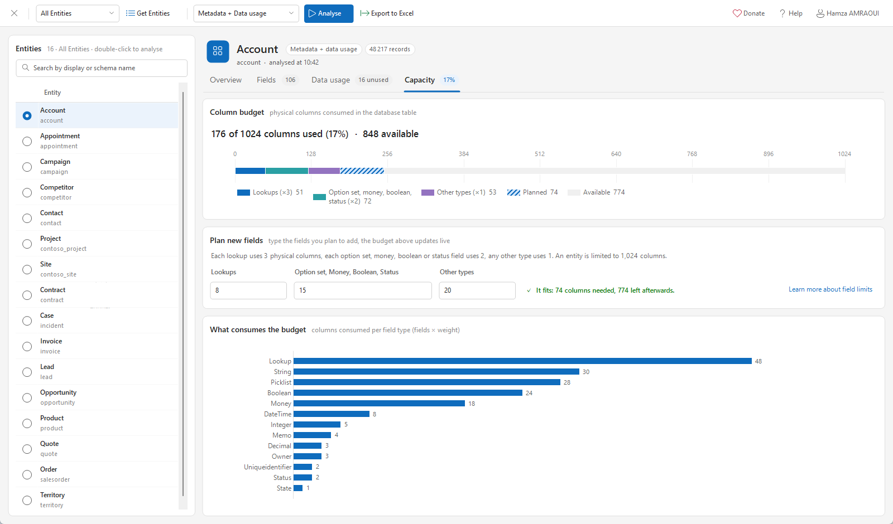
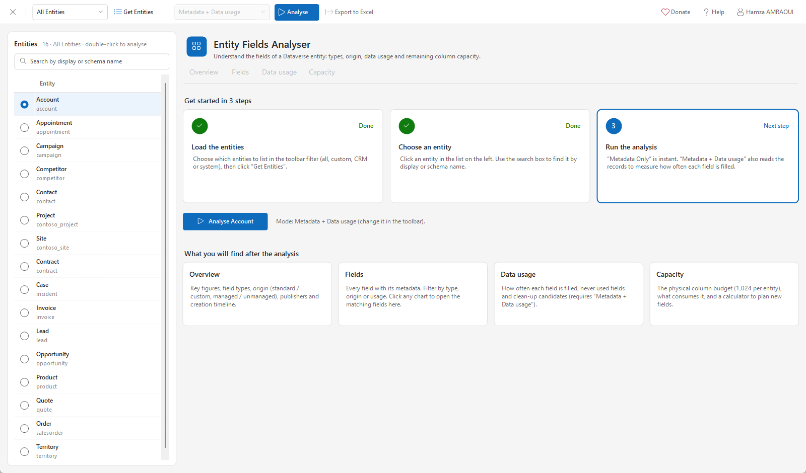

# Entity Fields Analyser

An [XrmToolBox](https://www.xrmtoolbox.com/) tool to understand the fields of any Dataverse / Dynamics 365 table: what they are, where they come from, whether they are actually used, and how much room is left before the column limit.

## Features

### Overview
- Key figures: fields, custom fields, unmanaged fields and column capacity used.
- Field types, origin (standard / custom, managed / unmanaged), custom fields per publisher prefix and fields created over time.
- Field settings: share of fields with auditing, Advanced Find, required level and field security.
- **Every chart is clickable**: click a bar, slice or tile to open the matching fields, already filtered.

### Fields
- Every field with its metadata: type, target, managed state, required level, auditing, searchable, security, versions, dates and more (toggle *All metadata columns*).
- Quick filters (*Custom*, *Unmanaged*, *Required*, *Never used*), type filter and search.
- The active drill-down filter is shown as a chip and removed in one click.
- Export the results to Excel.

### Data usage
Available with the **Metadata + Data usage** mode.
- Fill rate of each field across all records.
- Never used and rarely used (< 5%) fields, average fill rate.
- Fill rate distribution, fill rate by type and least used custom fields: your clean-up candidates.

> This mode reads every record of the table. It can take a while on large tables.

### Capacity
- Physical column budget against the 1,024 column limit of a table.
- What consumes the budget, per field type.
- Live calculator: type the fields you plan to add and see whether they fit.

Each field type uses a different number of physical columns:

| Field type | Columns |
|---|---|
| Lookup, Owner | 3 |
| Option set, Money, Boolean, Status | 2 |
| Any other type | 1 |

More details: [Field limits in Dynamics 365: how many fields is too many fields?](https://hamzaamraoui.medium.com/field-limits-in-dynamics-365-how-many-fields-is-too-many-fields-ab39c699336e)

## Installation

1. Open XrmToolBox.
2. Open the **Tool Library**.
3. Search for **Entity Fields Analyser** and install it.

## How to use

1. Choose an entity filter in the toolbar (all, custom, CRM or system entities) and click **Get Entities**.
2. Click an entity in the list. Use the search box to find it by display or schema name.
3. Choose the analysis mode:
   - **Metadata Only**: instant, metadata only.
   - **Metadata + Data usage**: also measures how often each field is filled.
4. Click **Analyse** (or double-click the entity), then browse the **Overview**, **Fields**, **Data usage** and **Capacity** tabs.
5. Click **Export to Excel** to save the results.

## Build from source

Requirements: Visual Studio with the .NET Framework 4.6.2 targeting pack, and XrmToolBox installed in `C:\XrmToolBox`.

1. Open `EntityieldsAnalyser.sln` and restore the NuGet packages.
2. Build in **Debug**: the plugin is copied to `%APPDATA%\MscrmTools\XrmToolBox\Plugins` (close XrmToolBox first, the file is locked while it runs).
3. Press **F5** to start `C:\XrmToolBox\XrmToolBox.exe` with the debugger attached.

The project has no third-party UI dependency: icons come from the Segoe Fluent Icons / Segoe MDL2 Assets fonts shipped with Windows, and charts use `System.Windows.Forms.DataVisualization`.

## Feedback

Issues and ideas are welcome: open an issue on GitHub or contact me at hamzamraoui11@gmail.com.

Created by [Hamza AMRAOUI](https://www.linkedin.com/in/hamza-amraoui/). If the tool saves you time, you can support it via [PayPal](https://www.paypal.me/EntityFieldsAnalyser).
